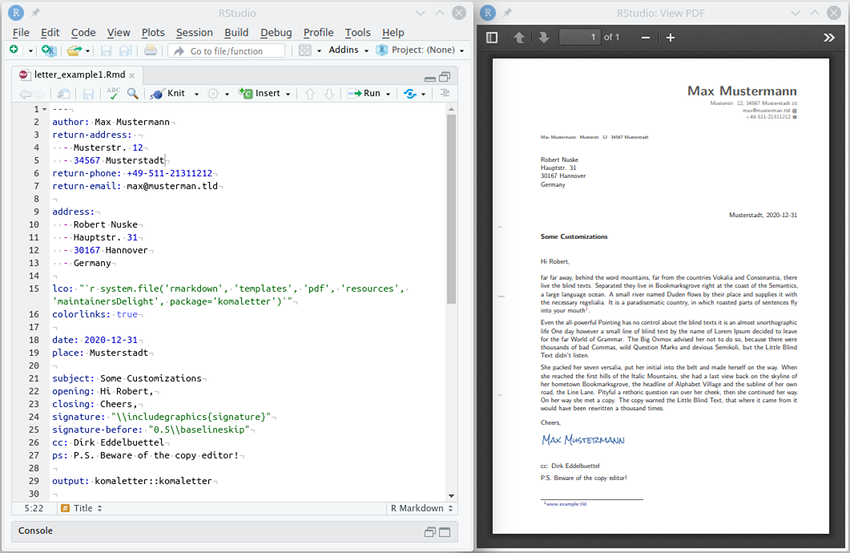

Komaletter: simple yet flexible Letters via the KOMA-Script LaTeX Bundle 


### Motivation
Simple letters tend to look very much alike. They are either determined by a 
standard eg. window envelope style or writer's preferences. If the layout is fixed,
they lend themselves to be written in R Markdown.

The [KOMA-Script LaTeX Bundle](https://www.komascript.de) provides layouts for
many common window envelope types (German, US, French, Japanese, ...) and the
possibility to define your own. *komaletter* also provides it's own default
layout loosely based on DIN 5008B in the so-called Letter Class Option file
'maintainers_delight.lco'  

This package is an adaptation of [linl](https://cran.r-project.org/package=rmarkdown) 
by Dirk Eddelbuettel and Aaron Wolen which in turn leans on earlier work by 
Aaron Wolen in his [pandoc-letter](https://github.com/aaronwolen/pandoc-letter) 
repository, and extends it for use from R via the
[rmarkdown](https://cran.r-project.org/package=rmarkdown) package.


### Example

#### Skeleton
The skeleton creates a very simple letter.  This shows the (complete) source 
on the left and the rendered pdf on the right:


Several formatting defaults for font, fontsize, indentation are in use. See 
`help(komaletter)` for a complete list and default values.

#### Vignette
The vignette example is a little more featureful and shows how to include a 
signature and a few formatting settings. All of these are driven by simple 
YAML headers as seen on the left:



The vignette also contains a few lines of vignette metadata one would be 
excluded from a normal letter.


### Status
The package works as intended but still needs some testing.


### Usage 
Since the package is not yet on CRAN, the best guess is to use devtools

```r
devtools::install_github("rnuske/komaletter")
```

then use as a Markdown template via RStudio, or use code such as

```r
library(rmarkdown)
draft("myletter.Rmd", template="pdf", package="komaletter", edit=FALSE)
render("myletter.Rmd")
```

to create a first draft of a new `myletter.Rmd`.


### Requirements
Beyond the R package dependencies, a working `pandoc` binary and a LaTeX 
distribution including KOMA-Script is needed. RStudio installs its own copy of 
pandoc, otherwise do what is needed on your OS (_i.e._, something like `sudo 
apt-get install pandoc pandoc-citeproc`). For LaTeX look for `texlive` which is
included in most Linux distributions or `MiKTeX` if you are using Windows. 
KOMA-Script is part of all but the most bare bone LaTeX distribution. Something
like `sudo apt-get install texlive` should provide everything needed.


### Authors
Robert Nuske, Dirk Eddelbuettel and Aaron Wolen.


### License
GPL-3 for this package, the work in [pandoc-letter](https://github.com/aaronwolen/pandoc-letter), 
as well as underlying Pandoc template.
